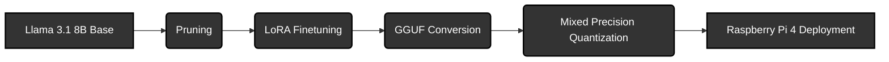

## LLM Compression & Deployment on Raspberry Pi 4




## Overview
This repository contains the methodology, scripts, and results for compressing Llama 3.1 8B to run efficiently on a Raspberry Pi 4 (8GB). By combining structural pruning, LoRA fine-tuning, and advanced quantization (AWQ/IMatrix) via llama.cpp, we reduced the model's memory footprint by ~80% while maintaining linguistic coherence.


## Contributors
* **Muhammad Rayed** - [Rider9797](https://github.com/Rider9797)
* **Abubakar Minhas** - [AbubakarMin1](https://github.com/AbubakarMin1)
* **Sana Humayun** - [sanahumayun](https://github.com/sanahumayun) 
* **Hammad Yousaf** - [HammadYousaf](https://github.com/HammadYousaf-26100387)


## Abstract

Deploying state-of-the-art Large Language Models (LLMs) on edge devices is hindered by massive RAM requirements. A standard Llama 3.1 8B model requires ~16GB (FP16), making it impossible to run on a Raspberry Pi 4. This project bridges this gap by applying a multi-stage compression pipeline. We successfully reduced the model size from 16GB to 3.99GB, achieving functional inference on Rasberyy Pi 4 using Llama.cpp.


## Methodology and Pipeline
(Refer to the project report: `report.pdf` for a detailed description)


1. **Structual Pruning**
   * MLP heads only
   * Layers 4 - 27

2. **Low Rank Adaptation**
   * Recover the model's intelligence
   * Dataset: yahma/alpaca-cleaned

3. **GGUF Conversion**
   * Patched the official convert_hf_to_gguf.py conversion file in llama.cpp to cater for variable MLP widths

4. **Mixed Precision Quantization**
   * Used llama.cpp to quantize the model into variable bit widths

5. **Deployment**
   * Deployment on Raspberry Pi 4
   * [Demo](https://drive.google.com/drive/folders/1g4A-UDaBDVvFdVbbToNewrKtA8pUW3VZ?usp=sharing)


## Results
(Refer to the project report: `report.pdf` for detailed results)


**Size Reduction:**

| Model Variant | Precision / Format | Size (GB) |
| :--- | :--- | :--- |
| Llama 3.1 8B Base | FP32 | 32.0 |
| Llama 3.1 8B Base | FP16 | 16.0 |
| Llama 3.1 8B Pruned (25%) | FP16 | 12.99 |
| Llama 3.1 8B Pruned | GGUF (4,6-bit Mixed) | ~3.99 |
| Llama 3.1 8B Pruned | GGUF (3,4-bit Mixed) | ~3.27 |


**Paramter Count:**
| Model State | Total Parameter Count |
| :--- | :--- |
| Before Pruning | 8,030,261,248 (8.03B) |
| After Pruning | 6,973,296,640 (6.97B) |
| **Reduction %** | **13.16%** |


**Perplexity (PPL) across Model Variants::**


| Model Configuration | Perplexity (PPL) |
| :--- | :--- |
| FP16 (Base) | 5.56 |
| Pruned FP16 | 11.38 |
| Pruned FP16 Fine-tuned | 9.78 |
| Standard Q4_K_M | 10.16 |
| AWQ + Q4_K_M | 10.24 |
| Standard Q3_K_M | 11.00 |
| AWQ + Q3_K_M | 11.14 |


**Hardware Benchmarks of the Final Model on Rasbperry Pi 4:**

| Model Variant | TTFT (s) | TTML (s) | TPS | Memory (GB) |
| :--- | :--- | :--- | :--- | :--- |
| Final Model(Pruned + 4, 6 Bit Quanitzed) | 4.35  | 189.86 | 0.80 | 4.99 |


## File Overview

| File | Description |
| :--- | :--- |
| `report.pdf` | Project Report |
| `pruning.py` | Patches `LLM-Pruner` and runs MLP-only pruning on an A100 GPU. Saves results to the cloud volume. |
| `conversion.py` | Downloads the pruned checkpoint from the volume, "cleans" the custom architecture, and converts it to FP16 GGUF. |
| `quantize_model.py` | **(Option A)** Performs standard quantization (Fastest setup). |
| `quantize_imatrix.py` | **(Option B)** Performs "Data-Aware" quantization using an Importance Matrix. |
| `convert_hf_to_gguf.py` | A patched version of the official script that handles variable MLP sizes (critical for pruned models). |

## Prerequisites

1.  **Modal Account:**
    * Install the Modal client: `pip install modal`
    * Setup your account: `modal setup`
    
2. **Llama.cpp Framework**
   * Either install the framework or clone the [offical repository](https://github.com/ggml-org/llama.cpp)

2.  **Hugging Face Token:**
    * You must create a Secret in Modal named `huggingface-secret`.
    * It should contain your `HF_TOKEN` (required to download Llama 3.1).

3.  **Volume Configuration:**
    * Ensure all scripts reference the same volume name: `llama31-mlp-only`.
  


## Usage Guide

### Step 1: Pruning
Use Modal to run the pruning job on a cloud A100 GPU. This script automatically applies necessary fixes to the `LLM-Pruner` library.

```bash
modal run pruning.py
```

- Input: meta-llama/Llama-3.1-8B-Instruct
- Action: Prunes 25% of MLP layers.
- Output: Saved to Modal Volume llama31-mlp-only.

### Step 2: Conversion to GGUF Format
Mounts the volume, standardizes the checkpoint structure, and creates a raw FP16 GGUF file.

```bash
modal run conversion.py
```

- Output: /data/pruned_model.gguf (inside the cloud volume).

### Step 3: Quantization
The following quantization techniques have been used for this project, but you can use others based on your hardware requirements. [Learn more about quantization formats in llama.cpp here](https://github.com/ggml-org/llama.cpp/pull/1684).

#### Option A: Standard Quantization (Fastest)
Applies (Q4_K_M) quantization format, which assigns 4,6 bit mixed precision quantization.
Run the pruning job on a cloud A100 GPU. This script automatically applies necessary fixes to the `LLM-Pruner` library.

```bash
modal run quantize_model.py
```

#### Option B: Smart IMatrix Quantization (Recommended for Q3)
Best for 3-bit models (Q3_K_M). It calculates an "Importance Matrix" to identify and protect essential weights, preventing the quality degradation usually associated with heavy compression.

```bash
modal run quantize_imatrix.py
```


