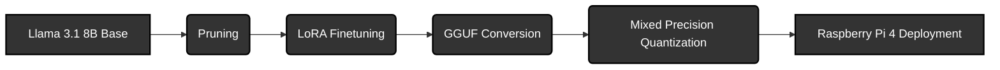

## LLM Compression & Deployment on Raspberry Pi 4

## Overview
This repository contains the methodology, scripts, and results for compressing Llama 3.1 8B to run efficiently on a Raspberry Pi 4 (8GB). By combining structural pruning, LoRA fine-tuning, and advanced quantization (AWQ/IMatrix) via llama.cpp, we reduced the model's memory footprint by ~80% while maintaining linguistic coherence.

## Abstract

Deploying state-of-the-art Large Language Models (LLMs) on edge devices is hindered by massive RAM requirements. A standard Llama 3.1 8B model requires ~16GB (FP16), making it impossible to run on a Raspberry Pi 4. This project bridges this gap by applying a multi-stage compression pipeline. We successfully reduced the model size from 16GB to 3.99GB, achieving functional inference on Rasberyy Pi 4 using Llama.cpp.

## Methodology and Pipeline
1. **Structual Pruning**
   * MLP heads only
   * Layers 4 - 27

2. **Low Rank Adaptation**
   * Recover the model's intelligence
   * Dataset: yahma/alpaca-cleaned

3. **GGUF Conversion**
   * Patched the official convert_hf_to_gguf.py conversion file in llama.cpp to cater for variable MLP widths

4. **Mixed Precision Quantization**
   * Used llama.cpp to quantize the model into variable bit widths

5. **Deployment**
   * Deployment on Raspberry Pi 4
   * [Demo](https://drive.google.com/drive/folders/1g4A-UDaBDVvFdVbbToNewrKtA8pUW3VZ?usp=sharing)

## Results

**Size Reduction:**

| Model Variant | Precision / Format | Size (GB) |
| :--- | :--- | :--- |
| Llama 3.1 8B Base | FP32 | 32.0 |
| Llama 3.1 8B Base | FP16 | 16.0 |
| Llama 3.1 8B Pruned (25%) | FP16 | 12.99 |
| Llama 3.1 8B Pruned | GGUF (4,6-bit Mixed) | ~3.99 |
| Llama 3.1 8B Pruned | GGUF (3,4-bit Mixed) | ~3.27 |

**Paramter Count:**
| Model State | Total Parameter Count |
| :--- | :--- |
| Before Pruning | 8,030,261,248 (8.03B) |
| After Pruning | 6,973,296,640 (6.97B) |
| **Reduction %** | **13.16%** |

**Perplexity (PPL) across Model Variants::**

| Model Configuration | Perplexity (PPL) |
| :--- | :--- |
| FP16 (Base) | 5.56 |
| Pruned FP16 | 11.38 |
| Pruned FP16 Fine-tuned | 9.78 |
| Standard Q4_K_M | 10.16 |
| AWQ + Q4_K_M | 10.24 |
| Standard Q3_K_M | 11.00 |
| AWQ + Q3_K_M | 11.14 |

**Hardware Benchmarks of the Final Model on Rasbperry Pi 4**

| Model Variant | TTFT (s) | TTML (s) | TPS | Memory (GB) |
| :--- | :--- | :--- | :--- | :--- |
| Final Model(Pruned + 4, 6 Bit Quanitzed) | 4.35  | 189.86 | 0.80 | 4.99 |

